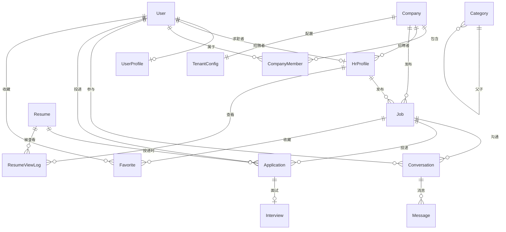

# 聘聊 · 数据模型设计

> 版本：v0.3 · 最后更新：2026-09-21
> 配套 ERD：`prisma/schema.prisma`
> 本文档与 schema.prisma 同步更新。

---

## 1. 总览

### 1.1 多租户字段约定

- **租户 = 企业客户**，主键 `companyId`。
- 表分为两类：
  - **跨租户共享表**（求职者侧）：不带 `companyId`。
  - **租户私有表**（企业侧）：带 `companyId`，由拦截器自动注入。

### 1.2 命名规范

- 表名：`PascalCase`（Prisma model）/ `snake_case`（PG 物理表名，由 MyBatis-Plus 映射）。
- 字段名：`camelCase`（前后端统一），PG 物理列名 `snake_case`。
- 时间字段：`createdAt` / `updatedAt`，类型 `DateTime`，存 UTC。
- 主键：`String`，默认 `cuid()`（PG 端可换 `uuid` 或雪花 ID，应用无感）。

### 1.3 软删除

- 关键业务表（Job / Application / Resume / Message）使用 `deletedAt DateTime?` 软删除。
- 软删除字段建索引，查询时 `WHERE deleted_at IS NULL`。

---

## 2. 表清单

### 2.1 跨租户共享表（求职者侧）

| 表 | 说明 | 多租户字段 |
|---|---|---|
| User | 账号（求职者+招聘者通用） | 无 |
| UserProfile | 求职者画像 | 无 |
| Resume | 简历 | 无 |
| Favorite | 收藏 | 无（求职者视角），但关联的 Job 带 companyId |
| AuditLog | 审计日志 | 无（全局） |
| City | 城市字典 | 无 |
| Category | 分类树 | 无 |
| SysConfig | 系统配置 | 无 |

### 2.2 租户私有表（企业侧）

| 表 | 说明 | 多租户字段 |
|---|---|---|
| Company | 企业（即租户） | 自身主键 `id` 即 companyId |
| CompanyMember | 企业成员 | `companyId` |
| HrProfile | 招聘者画像 | `companyId` |
| Job | 职位 | `companyId` |
| Conversation | 会话 | `companyId` |
| Message | 消息 | `companyId` |
| Application | 投递 | `companyId` |
| Interview | 面试邀请 | `companyId` |
| ResumeViewLog | 简历查看记录 | `companyId` |
| TenantConfig | 租户配置 | `companyId` |
| UsageLog | 用量埋点 | `companyId` |

---

## 3. 关键表结构详解

> 字段定义见 `prisma/schema.prisma`。此处仅说明设计意图。

### 3.1 User（账号）

- 通用账号表，求职者与招聘者共用。
- `role` 枚举：`JOB_SEEKER` / `HR` / `COMPANY_ADMIN` / `PLATFORM_ADMIN`。
- `phone` 唯一（国内招聘 App 主流登录方式）。
- `email` 可空，作为辅助联系方式。
- 密码字段 `passwordHash`，OAuth 用户可空。
- 与 `UserProfile`（求职者）和 `HrProfile`（招聘者）一对一关联，按角色决定哪张表有数据。

### 3.2 UserProfile（求职者画像）

- 求职意向：`expectCat` / `expectSub` / `expectCity` / `expectSalaryMin` / `expectSalaryMax`。
- 求职状态：`seekingStatus` 枚举（`ACTIVE` / `PASSIVE` / `NOT_LOOKING`）。
- 工作年限、最高学历等基本信息。
- 默认简历 ID：`defaultResumeId`。

### 3.3 Resume（简历）

- 一份简历可包含多个段（教育、工作、项目），首发以 JSON 字段存储（PG `Json` 类型）。
- `content Json` 结构化存储：`{ basics, educations, experiences, projects, skills }`。
- `attachmentUrl` 简历附件 URL（PDF/Word）。
- 后期如需更强查询，可拆分为独立表。

### 3.4 Company（企业）

- 即租户主表。
- `logoUrl` / `intro` / `industry` / `stage` / `size` 等公开信息。
- `verified` 认证状态。
- `customDomain` / `themeColor` 白标预留。
- `status` 枚举（`ACTIVE` / `SUSPENDED` / `PENDING`）。

### 3.5 CompanyMember（企业成员）

- 一个企业可多个成员（HR / 管理员）。
- `role` 枚举（`ADMIN` / `HR`）。
- `userId` 关联 User。

### 3.6 HrProfile（招聘者画像）

- 招聘者展示给求职者看的信息。
- `name` / `title`（如"招聘专员"）/ `avatarUrl`。
- `companyId` 关联 Company。

### 3.7 Job（职位）

核心字段：
- `title` / `salaryMin` / `salaryMax` / `city` / `area` / `exp` / `edu` / `cat`（一级分类）/ `sub`（二级岗位）/ `tags Json` / `responsibilities String` / `requirements String` / `welfare Json`。
- `companyId` / `hrId`（发布者）。
- `status` 枚举（`OPEN` / `CLOSED` / `DRAFT`）。
- `publishedAt` 发布时间，用于"最新"排序。
- `viewCount` / `applyCount` 统计字段。
- `deletedAt` 软删除。

**索引**：
- `idx_job_list(city, cat, status, publishedAt desc)` — 列表筛选主索引。
- `idx_job_company(companyId, status)` — 招聘者后台。
- `idx_job_hr(hrId, status)` — 招聘者个人发布列表。
- `idx_job_search` — 全文索引（PG `tsvector`）。

### 3.8 Conversation（会话）

- 求职者与某公司某 HR 关于某职位的会话。
- `jobId` / `userId`（求职者）/ `hrId` / `companyId`。
- 唯一约束：`(jobId, userId)` 唯一（同一求职者对同一职位只能有一个会话）。
- `lastMessageAt` 用于会话列表排序。
- `userUnreadCount` / `hrUnreadCount` 未读计数。

### 3.9 Message（消息）

- `conversationId` 关联会话。
- `fromType` 枚举（`USER` / `HR` / `SYSTEM`）。
- `type` 枚举（`TEXT` / `RESUME` / `INTERVIEW_INVITE` / `JOB_CARD`）。
- `content` 文本或 JSON。
- `createdAt` 创建时间。
- `readAt` 已读时间（双方分别记录）。

### 3.10 Application（投递）

- `userId` / `jobId` / `companyId` / `resumeId`。
- `status` 枚举（`SUBMITTED` / `VIEWED` / `INTERVIEW` / `OFFER` / `REJECTED` / `WITHDRAWN`）。
- `coverLetter` 求职信（可选）。
- `createdAt` / `updatedAt` / `deletedAt`。
- 唯一约束：`(userId, jobId)` 唯一（同一求职者对同一职位只能投递一次）。

### 3.11 Interview（面试邀请）

- `applicationId` 关联投递。
- `companyId` 冗余（多租户隔离）。
- `scheduledAt` 面试时间。
- `location` / `onlineUrl` 线上/线下。
- `format` 枚举（`ONSITE` / `VIDEO` / `PHONE`）。
- `status` 枚举（`PENDING` / `ACCEPTED` / `DECLINED` / `COMPLETED` / `CANCELLED`）。

### 3.12 Favorite（收藏）

- 求职者收藏的职位。
- `userId` / `jobId`。
- 唯一约束：`(userId, jobId)` 唯一。
- `createdAt`。

### 3.13 ResumeViewLog（简历查看记录）

- 招聘者查看求职者简历的记录。
- `companyId` / `hrId` / `userId` / `resumeId`。
- 用于计费与隐私审计。

### 3.14 AuditLog（审计日志）

- `actorId` / `actorType` / `action` / `targetType` / `targetId` / `metadata Json` / `ip` / `createdAt`。
- 全局表，只追加不修改。

### 3.15 City（城市字典）

- 静态字典表，预置常用城市。
- `code` / `name` / `province` / `hot`（是否热门）。

### 3.16 Category（分类树）

- 一二级分类，自关联。
- `parentId` 父分类，一级分类 `parentId = null`。
- `name` / `sort` / `icon`。

### 3.17 TenantConfig（租户配置）

- `companyId` 主键关联 Company。
- `maxJobs` / `maxHrAccounts` / `maxMonthlyReach` 配额。
- `features Json` 功能开关。
- `expiresAt` 服务到期时间。

### 3.18 UsageLog（用量埋点）

- `companyId` / `type`（`JOB_PUBLISH` / `RESUME_VIEW` / `MESSAGE_SEND` 等）/ `count` / `day`。
- 按天聚合，用于计费与限流。

---

## 4. 关系图（Mermaid）

---

## 5. 索引设计要点

| 表 | 索引 | 用途 |
|---|---|---|
| Job | (city, cat, status, publishedAt desc) | 列表筛选主索引 |
| Job | (companyId, status) | 招聘者后台 |
| Job | (hrId, status, publishedAt desc) | 招聘者个人 |
| Job | tsvector(title, company, tags, area) | 全文搜索 |
| Conversation | (userId, lastMessageAt desc) | 求职者会话列表 |
| Conversation | (hrId, lastMessageAt desc) | 招聘者会话列表 |
| Conversation | unique(jobId, userId) | 唯一会话 |
| Message | (conversationId, createdAt) | 消息时序 |
| Application | (userId, createdAt desc) | 求职者投递列表 |
| Application | (companyId, status, createdAt desc) | 招聘者筛选 |
| Application | unique(userId, jobId) | 唯一投递 |
| Favorite | unique(userId, jobId) | 唯一收藏 |
| Favorite | (userId, createdAt desc) | 收藏列表 |
| ResumeViewLog | (companyId, hrId, createdAt desc) | 招聘者查看记录 |
| AuditLog | (actorId, createdAt desc) | 用户审计 |

---

## 6. 升级路径预留

| 需求 | 升级方式 | 应用层改动 |
|---|---|---|
| 职位搜索复杂度上升 | 引入 Elasticsearch，`/api/v1/search/jobs` 切到 ES | 仅 service 层 |
| 读写分离 | ShardingSphere-JDBC 多数据源 | 仅配置 |
| 大客户独立库 | ShardingSphere 路由按 `companyId` 分库 | 仅配置 |
| 简历结构化查询 | Resume content JSON → 拆表 | 迁移脚本 + service 层 |
| 消息海量 | Message 表按月分区 / 归档到冷库 | DAO 层加分区键 |

---

## 7. 修订记录

| 版本 | 日期 | 变更 |
|---|---|---|
| v0.3 | 2026-09-21 | Step 0 初版：表清单、字段、索引、关系图 |
